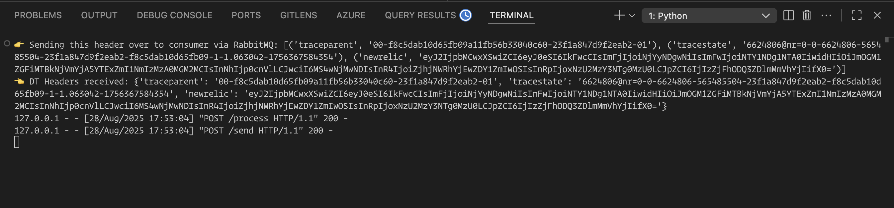
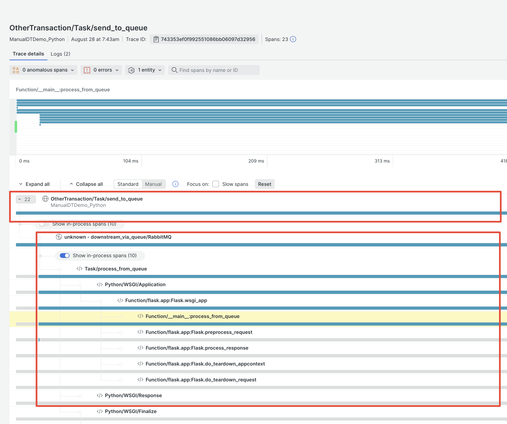

# Manual Distributed Tracing with New Relic

## How to Run the Manual Distributed Tracing Demo with New Relic

### Prerequisites
- Python 3.x
- New Relic account and license key

### Setup
1. Clone this repository:
	```
	git clone https://github.com/nvhoanganh/manual_dt_with_NewRelic.git
	cd manual_dt_with_NewRelic
	```
2. Install dependencies:
	```
	pip install flask requests newrelic
	```
3. Create or update `newrelic.ini` with your license key and app name.

### Running the App
1. Start the Flask app with New Relic agent:
	```
	newrelic-admin run-program python3 manual_dt_flask_demo.py
	```
2. In a separate terminal, trigger the distributed tracing flow by sending this request multiple times:
	```
	curl -X POST http://localhost:5000/send
	```
	This will simulate sending a message to a queue and processing it, with distributed tracing headers propagated between endpoints.





### Viewing Data in New Relic
- Log in to your New Relic dashboard and look for traces under the app name you configured in `newrelic.ini`.

### Troubleshooting
- Ensure your license key is correct in `newrelic.ini`.
- Make sure you run the app using `newrelic-admin run-program`.
- If you don't see traces, check the agent logs for errors.
